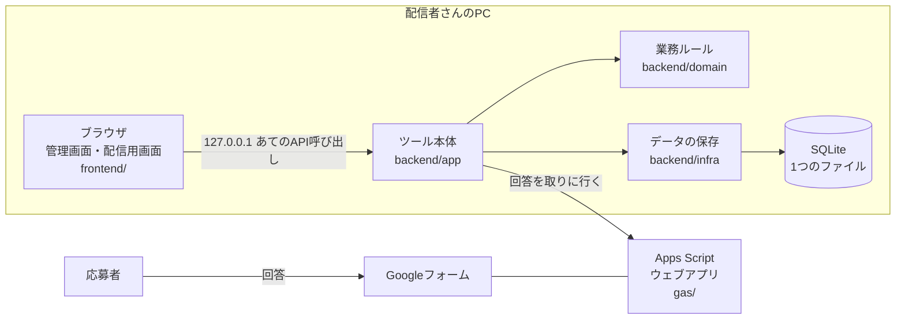

# はじめに（初めて読む人向けガイド）

このリポジトリを初めて読む人が、全体像をつかむためのガイドです。わからない言葉は [用語集](用語集.md) を見てください。

## 1. 何を作っているか
配信者さんが行う「艦隊分析」には応募が殺到します。このツールは、Googleフォームで受け付けた応募を取り込んで、

- 誰が分析済みで、次は誰か（進捗管理）
- 同じ人の重複応募や、条件に合わない応募のチェック
- 応募が多すぎるときの抽選
- 配信に映しても問題ない形での表示

を行うWebアプリです。詳しくは [仕様書](../spec.md) を見てください。

## 2. 全体の仕組み

仕様 v1.2（2026-10-03）で、ツールは配信者さんのPCだけで動く形になりました（[仕様書の付録C](../spec.md)）。完成したときの形は次のとおりです。



- 応募者はフォームに答えるだけで、このツールには触りません
- ツールは配信者さんのPCの中（127.0.0.1）でだけ待ち受け、ログインはありません。ほかのWebサイトからの攻撃は、届いた要求の Host・Origin ヘッダーを確かめて防ぎます（`backend/app` の `LocalAccessFilter`）
- 画面（frontend）とサーバー（backend）は別々のプログラムで、APIを通してやりとりします
- APIの形は `api/openapi.yaml` で決めていて、画面とサーバーの両方がそこから自動生成したコードを使います

今のコードとの違い（段階4〜6で作っていきます）:
- データは SQLite のファイルに保存します（段階4 その2）。手元で試すときの起動スクリプトは、ふだんはメモリに置きます（下の5章）
- フォームの回答を取りに行くのは段階5です。今のフォーム連携（`gas/`）は、なくした受付APIに送る v1.1 の形のままです
- 画面は Vite の開発サーバーから開いています。ツールの中から画面を配信するのは段階4の次のPRです

## 3. ディレクトリの歩き方

| 場所 | 中身 | 説明 |
|---|---|---|
| `docs/` | 仕様書、設計メモ、開発ルール、このガイド | まずここ |
| `api/` | API定義 | [api/README.md](../../api/README.md) |
| `backend/` | サーバー側（Java） | [backend/README.md](../../backend/README.md) |
| `frontend/` | 画面（React） | [frontend/README.md](../../frontend/README.md) |
| `gas/` | Googleフォーム連携 | [gas/README.md](../../gas/README.md) |
| `.github/workflows/` | 自動チェック（CI）の設定 | `ci.yml` にコメントあり |
| `gradle/`, `*.gradle.kts` | Javaのビルド設定 | 各ファイルにコメントあり |

## 4. おすすめの読む順番
1. [仕様書](../spec.md) の1〜3章: 何を作るか
2. このガイドの2章: どうつながっているか
3. `backend/domain/.../lottery/WeightedLottery.java` とそのテスト: 小さく完結した業務ロジックの例
4. `api/openapi.yaml` の `/applications/{applicationId}`: APIの書き方の例
5. `backend/app/build.gradle.kts`: 定義からコードを生成する仕組み
6. [開発ルール](../development.md): コードを書く前に

## 5. 手元で動かす

### 試作版を画面つきで動かす（いちばん簡単）
今は試作版で、AWSを使わずにデータをメモリに置いて動きます（止めると消え、起動するたびにサンプルデータに戻ります）。

**GitHub Codespaces で動かす場合（自分のPCに何も入れなくてよい）**
1. GitHub でこのリポジトリを開き、ブランチを選ぶ
2. 「Code」ボタン →「Codespaces」タブ → 作成ボタンを押す（公式の手順: https://docs.github.com/en/codespaces/developing-in-a-codespace/creating-a-codespace-for-a-repository ）
3. 準備が終わったら（初回は数分かかります）、下のターミナルで次を実行する
   ```sh
   ./scripts/dev.sh
   ```
4. ポート5173の画面がブラウザで開く（自動で開かないときは、下の「ポート」タブで 5173 の行のアドレスを開く）

> **注意: ポートは「Private（非公開）」のままにしてください。** Codespaces のポートは最初は自分だけが開ける設定です（公式: https://docs.github.com/en/codespaces/developing-in-a-codespace/forwarding-ports-in-your-codespace ）。このツールにはログインがないので、公開にするとURLを知っている人が誰でも応募データ（XのIDや課金額を含む）を見たり消したりできてしまいます。

**自分のPCで動かす場合**（必要なもの: Java 21、Node.js 22、Git）

まずリポジトリを取ってきて、試したいブランチに切り替えます（試作版は今 `claude/prototype` ブランチにあります）。
```sh
git clone https://github.com/otk-sudo/kancolle-fleet-analysis-manager.git
cd kancolle-fleet-analysis-manager
git switch claude/prototype
```

- **Windows の場合**: エクスプローラーで `scripts` フォルダを開き、`dev.cmd` をダブルクリックします（コマンドプロンプトなら、リポジトリの一番上のフォルダで `scripts\dev.cmd`）。止めるときは、そのウィンドウを閉じます。`dev.cmd` が何をしているかは [scripts/README.md](../../scripts/README.md) に日本語で書いてあります（`dev.cmd` の中は文字化けを防ぐため英語だけで書いています）
- **Mac・Linux の場合**: `./scripts/dev.sh` を実行します。止めるときは Ctrl+C です

どちらも、バックエンド（サンプルデータ入り）と画面をまとめて起動するスクリプトです。データはメモリに置くので、止めると消えます。止めてもデータを残したいときは、Windows なら `scripts\dev-db.cmd`、Mac・Linux なら `./scripts/dev.sh db` で起動します（リポジトリの一番上の `.local/data` に、SQLite のファイルとして保存します。詳しくは [scripts/README.md](../../scripts/README.md)）。「画面を起動します」と出たら、ブラウザで http://localhost:5173 を開きます。初回は部品のダウンロードで数分かかります。

Windows で気をつけること:
- 初回は「Windows セキュリティの重要な警告」（ファイアウォール）で Java や Node.js の通信を許可するか聞かれることがあります。自分のPCの中だけで使うので、どちらを選んでも試作版は動きます
- 回線が遅いと、初回のダウンロードが終わる前に時間切れのメッセージが出ることがあります。もう一度実行すると続きから進みます
- うまく動かないときは、`backend.log`（リポジトリの一番上にできる、バックエンドの記録）を見ます。Java 21 以外の Java が使われている、ポート8080をほかのソフトが使っている、がよくある原因です
- フォルダの場所（パス）に日本語や空白が入っていると、まれに動かない道具があります。おかしなエラーが出たら `C:\dev` のような英数字だけの場所に置いてみてください（確実に起きるとは確認していません）

> **Windows で Git Bash から `./scripts/dev.sh` を使いたい場合**: 改行コードの設定（`.gitattributes`）が入る前に取ってきたリポジトリだと、`\r: command not found` のようなエラーで動きません。Windows と Mac/Linux では改行の書き方が違い（Windows は CRLF、Mac/Linux は LF）、bash は LF でないと読めないためです。フォルダを消して `git clone` からやり直してください（自分で書き換えたファイルがあれば、先に別の場所へ保存してください）。`dev.cmd` を使う場合は関係ありません。

ログインはありません（仕様 v1.2）。開くとすぐ応募一覧が出ます。

| 画面 | URL | できること |
|---|---|---|
| 応募一覧 | `/` | 絞り込み、↑↓での並べ替え、重複・再応募の印の確認 |
| 応募詳細 | `/applications/<ID>` | 回答の確認、前回の応募との比較、ステータス・配信日・メモの変更 |
| 抽選 | `/lottery` | 抽選設定、まとめ抽選、抽選記録 |
| 設定 | `/settings` | 抽選の設定 |
| 配信用画面 | `/stream` | 分析中の1人を大きく表示（XのIDと課金額は出ない）、「次の人へ」で順番どおりに進める、配信中の抽選（抽選を使う設定のとき） |

### ビルドとテストだけ行う
```sh
./gradlew build          # サーバー側: ビルドとテスト
cd frontend
npm install
npm run lint && npm run build   # 画面: チェックとビルド
```

## 6. 開発の進め方
[設計メモ](../design.md) の5章にある段階0〜9の順に、少しずつ作っていきます。各段階は1つ以上のPRになり、PRの説明には「そのPRで初めて出てくる技術」と「試し方」を書きます。
