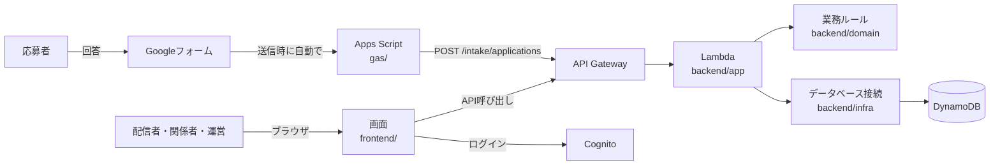

# はじめに（初めて読む人向けガイド）

このリポジトリを初めて読む人が、全体像をつかむためのガイドです。わからない言葉は [用語集](用語集.md) を見てください。

## 1. 何を作っているか
配信者さんが行う「艦隊分析」には応募が殺到します。このツールは、Googleフォームで受け付けた応募を取り込んで、

- 誰が分析済みで、次は誰か（進捗管理）
- 同じ人の重複応募や、条件に合わない応募のチェック
- 応募が多すぎるときの抽選
- 配信に映しても問題ない形での表示

を行うWebアプリです。詳しくは [仕様書](../spec.md) を見てください。

## 2. 全体の仕組み



- 左から右へデータが流れます。応募者はフォームに答えるだけで、このツールにはログインしません
- 画面（frontend）とサーバー（backend）は別々のプログラムで、APIを通してやりとりします
- APIの形は `api/openapi.yaml` で決めていて、画面とサーバーの両方がそこから自動生成したコードを使います

## 3. ディレクトリの歩き方

| 場所 | 中身 | 説明 |
|---|---|---|
| `docs/` | 仕様書、設計メモ、開発ルール、このガイド | まずここ |
| `api/` | API定義 | [api/README.md](../../api/README.md) |
| `backend/` | サーバー側（Java） | [backend/README.md](../../backend/README.md) |
| `frontend/` | 画面（React） | [frontend/README.md](../../frontend/README.md) |
| `gas/` | Googleフォーム連携 | [gas/README.md](../../gas/README.md) |
| `.github/workflows/` | 自動チェック（CI）の設定 | `ci.yml` にコメントあり |
| `gradle/`, `*.gradle.kts` | Javaのビルド設定 | 各ファイルにコメントあり |

## 4. おすすめの読む順番
1. [仕様書](../spec.md) の1〜3章: 何を作るか
2. このガイドの2章: どうつながっているか
3. `backend/domain/.../lottery/WeightedLottery.java` とそのテスト: 小さく完結した業務ロジックの例
4. `api/openapi.yaml` の `/intake/applications`: APIの書き方の例
5. `backend/app/build.gradle.kts`: 定義からコードを生成する仕組み
6. [開発ルール](../development.md): コードを書く前に

## 5. 手元で動かす
必要なもの: Java 21、Node.js 22、Git

```sh
git clone https://github.com/otk-sudo/kancolle-fleet-analysis-manager.git
cd kancolle-fleet-analysis-manager

# サーバー側: ビルドとテスト
./gradlew build

# 画面: 開発用サーバー
cd frontend
npm install
npm run dev
```

## 6. 開発の進め方
[設計メモ](../design.md) の5章にある段階0〜7の順に、少しずつ作っていきます。各段階は1つ以上のPRになり、PRの説明には「そのPRで初めて出てくる技術」と「試し方」を書きます。
